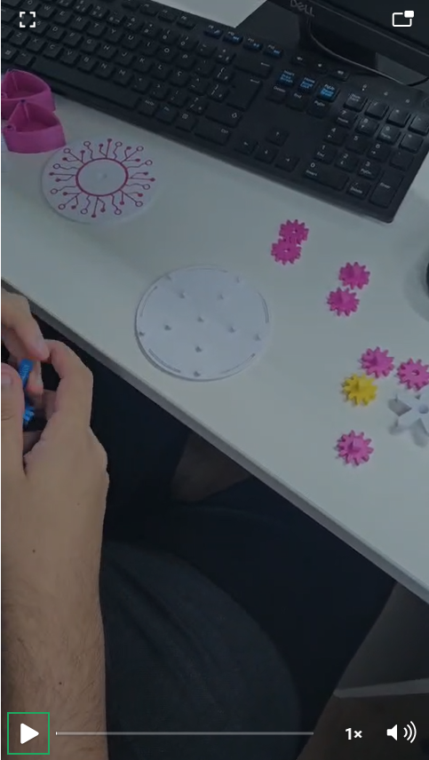
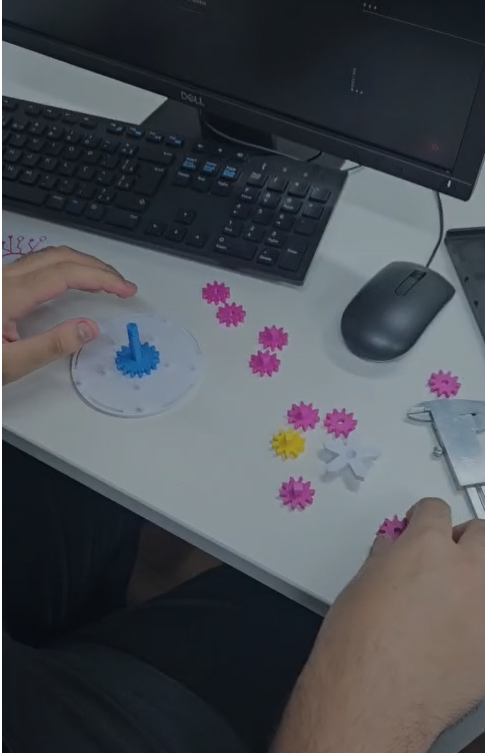
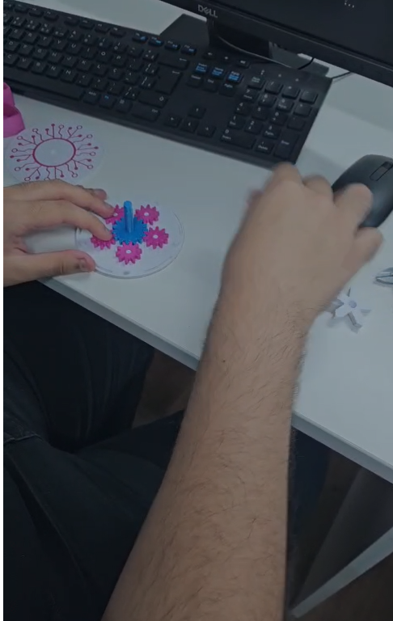
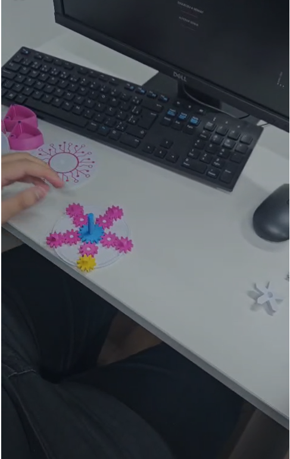
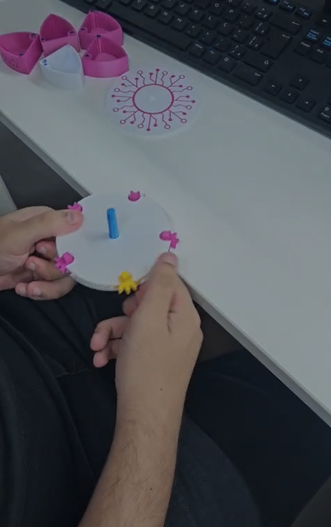
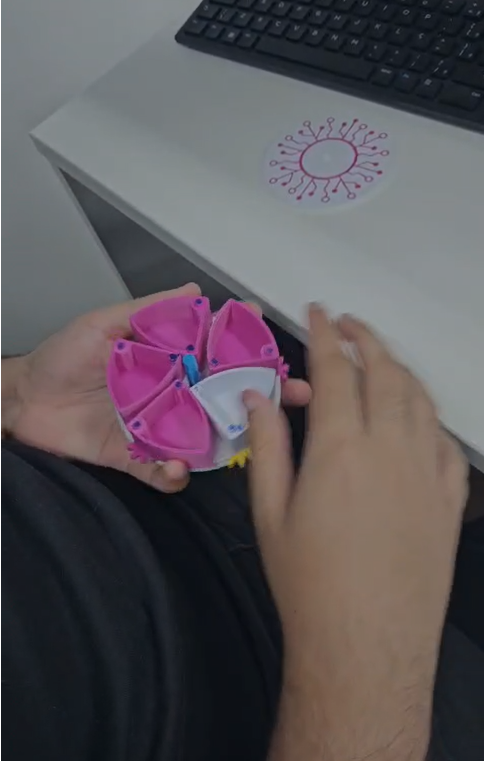
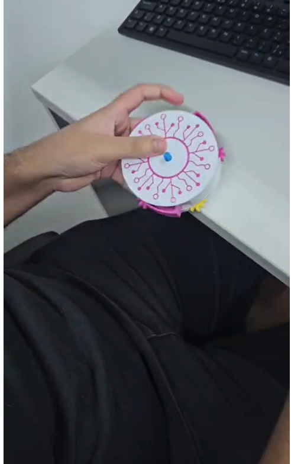
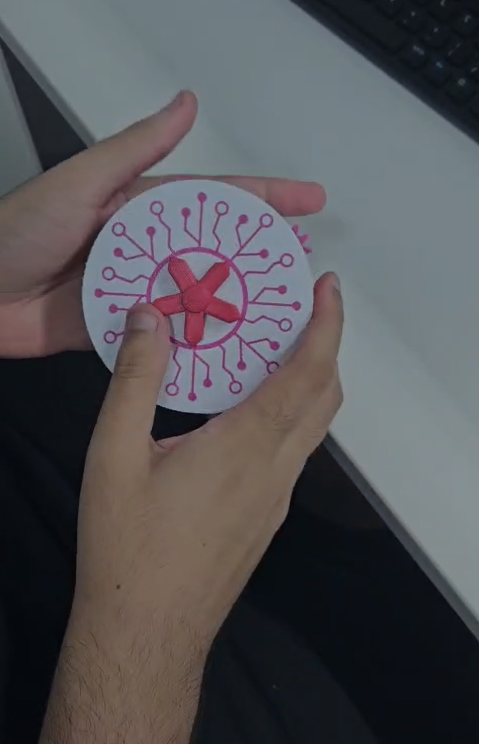
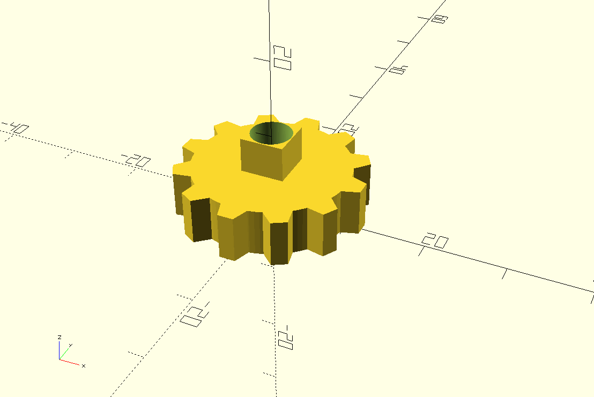

# Check Point 2: Caixa Mecânica com Engrenagens
## Disciplina: Project-based Maker Lab | Engenharia de Software - FIAP

Este repositório contém a documentação completa para a montagem e análise técnica de uma caixa mecânica funcional (Iris Box). O projeto visa aplicar conceitos de mecânica, medição de precisão com paquímetro e modelagem 3D paramétrica aplicada à Engenharia de Software.

---

## 👥 Integrantes do Grupo
*   Nikolas Rodrigues Moura dos Santos (RM551566)
*   Rodrigo Brasileiro (RM98952)
*   Bruno Eduardo Caputo Paulino (RM558303)

**Profª Responsável:** Me. Gedeane G.S. Kenshima

---

## 📐 Especificações e Medidas
Utilizamos um paquímetro para aferir as peças impressas. Estas medidas foram essenciais para garantir que o conjunto não travasse durante o uso.

| Peça | Atributo | Medida Real (mm) |
| :--- | :--- | :--- |
| **Tampa** | Espessura | 4.0 mm |
| **Caixa** | Diâmetro dos furos | 5.2 mm |
| **Eixos** | Diâmetro e Comprimento | Ø 5.0 mm / L 12.0 mm |
| **Engrenagem** | Largura/Espessura | 6.0 mm |
| **Eixos** | Distância entre centros | 22.5 mm |
| **Alojamento** | Profundidade interna | 30.0 mm |

---

## 🛠 Guia de Montagem (Passo a Passo)

### 1. Sincronização das Engrenagens
O segredo do funcionamento está na sincronia. Posicionamos a engrenagem central (azul) e distribuímos as periféricas (rosas e amarela) em formato de estrela. Os dentes devem estar perfeitamente engatados antes de fechar a base.

  
  
  
  

### 2. Montagem da Estrutura de Acionamento
Com as engrenagens posicionadas, instalamos a base de suporte branca. Os eixos das engrenagens periféricas devem atravessar os orifícios da base para permitir o acionamento das pétalas na parte superior.

  

### 3. Instalação das Pétalas (Gavetas)
Cada uma das 5 pétalas (gavetas) é encaixada nos eixos que ficaram expostos no passo anterior. É nesta etapa que o design da "Íris" começa a tomar forma, permitindo o armazenamento de componentes.

  

### 4. Finalização e Teste de Torque
Por fim, instalamos a tampa decorada e o pino de acionamento central. O teste de funcionalidade consiste em girar a tampa ou o pino: todas as gavetas devem expandir e retrair simultaneamente de forma fluida.

  
  
  

---

## 🔍 Observações Técnicas (Checklist)
*   **Encaixes:** Os eixos e furos foram projetados com uma tolerância de 0.2mm, resultando em encaixes firmes, mas que permitem a rotação.
*   **Rotação:** O sistema gira livremente. Não houve necessidade de lixamento das peças.
*   **Engate:** As engrenagens mantêm o contato constante, sem "pular" dentes durante o torque.
*   **Trava:** O movimento de abertura e fechamento é completo, sem obstruções mecânicas.

---

## 💻 Modelagem 3D
Realizamos a modelagem de uma das **Engrenagens Periféricas** utilizando a linguagem **OpenSCAD**.

*   **Destaque Técnico:** O modelo é paramétrico, permitindo ajustar o número de dentes e o diâmetro do furo central. A geometria foi otimizada para impressão FDM, dispensando o uso de suportes e reduzindo o desperdício de material.
*   **Arquivo:** Localizado em `/modelagem/engrenagem_periferica.scad`.

  

---

## 📂 Organização do Repositório
*   `/fotos`: Contém as imagens `img-1.png` a `img-10.png` documentando o processo.
*   `/modelagem`: Contém o arquivo fonte `.scad` e o exportado `.stl`.
*   `README.md`: Documentação técnica principal.

---
© 2026 FIAP - Engenharia de Software. Documentação de Check Point 2.